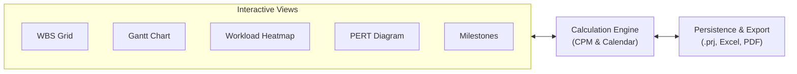

# Project Management Application

> A standalone, high-performance web application designed for Project Managers to plan, track, schedule, and execute complex product development projects, resource allocations, dependency networks, and baselines.


---

## 🌟 Key Features

### 📅 Interactive Task Sheet & WBS Hierarchy
- **Work Breakdown Structure (WBS)**: Unlimited nested subtask hierarchy with automatic WBS numbering (`1.1.2`).
- **Summary Task Auto-Aggregation**: Parent tasks auto-calculate duration, start/finish bounds, and weighted progress from child activities.
- **Milestone Diamonds**: Tasks with `0` duration automatically render as milestone diamonds.
- **Inline Spreadsheet Editing**: Edit Activity Name, Stage, Workstream, Status, Duration, Start Date, Predecessors, Vendor, and Lead Time directly in table cells.

### 📊 Bidirectional Interactive Gantt Chart
- **Real-Time Drag & Drop**:
  - Drag the body of any task bar to translate start and finish dates live.
  - Drag the right edge handle to extend or reduce task duration.
  - Changes on the Gantt timeline instantly update the WBS Activity table and vice versa.
- **SVG Dependency Lines & Arrowheads**: Visual orthogonal connection lines with direction arrows (`FS`, `SS`, `FF`, `SF` with positive/negative lag).
- **Critical Path Method (CPM)**: One-click toggle to highlight critical path activities and dependency arrows in bold red.
- **Baseline Shadow Ghost Bars**: Translucent shadow bars rendered below current task bars to visually compare current schedule against target baselines.

### 👥 Multi-Engineer Assignments & Fractional Day Loading
- **Multi-Engineer Tasks**: Assign one or more team members to a single task (e.g. *Priya Sharma 100%, Alex Rivera 50%*).
- **Fractional Allocation Units**: Configure daily allocation percentages (`25%` = 2h, `50%` = 4h, `75%` = 6h, `100%` = 8h).
- **Engineer Workload Heatmap**: 21-day timeline matrix calculating daily fractional loading per engineer. Overallocated dates ($>100\%$) are highlighted in **bold red**.

### 🗓️ Custom Project Calendar Engine (`CalendarEngine`)
- **Configurable Weekly Off Days**: Toggle standard working days (e.g. 5-day Mon–Fri or 6-day Mon–Sat work weeks).
- **Festive & Company Holidays**: Calendar manager to define custom company holidays; scheduling engine automatically skips holiday dates.
- **Overtime Exception Working Days**: Declare specific weekend or holiday dates as "Overtime Working Days" (e.g., crunch build Saturdays).
- **Gantt Calendar Shading**: Holidays and off days rendered with gray/red background shading; overtime working days highlighted in amber.

### 🕸️ Interactive Network Diagram & Dependency Tree (PERT)
- **Visual DAG Flowchart**: Visual flowchart of all activities grouped by stage pipelines.
- **Node Cards & Predecessor Chains**: Cards display WBS ID, Name, Workstream, Stage, Assigned Engineer, Duration, Lead Time, Start/Finish, and Status.
- **Critical Path Tracing**: Highlights critical path activities and links in bold red outline.

### ⚙️ Custom User Options & Extensibility
- **Predefined `SYS` Workstream**: Built-in support for System Engineering (`SYS`), alongside `HW`, `EE`, `ME`, `FW`, `PROC`, `TEST`, `MFG`.
- **Write-In Custom Options**: PMs can select `+ Add Custom...` directly inside grid dropdowns to define custom **Stages**, **Workstreams/Streams**, and **Status Pills**.

### 💾 Persistence, Sharing & Targeted Printing
- **Native `.prj` Format**: Save and open native JSON project bundle files containing tasks, resources, and calendar settings.
- **LocalStorage Auto-Save**: Background persistence preventing data loss.
- **Multi-Tab Excel (`.xlsx`) Export**: Export WBS Tasks, Milestones, Team Resources, and Project Calendar & Holidays tabs into Microsoft Excel.
- **Targeted PDF/Print Exports**: Separate print options to export the Gantt timeline alone, Activity sheet alone, or Milestone roadmap alone.
- **Info & User Guide Tab**: In-app `❓ Info & Guide` tab containing an expanded glossary of abbreviations and interactive tool manual.



---

## 🚀 Quick Start Guide

### Option 1: Standalone Single-File Distribution (Production)
Simply open the single bundled HTML file in any browser—no server, Node.js, or build step required:
```bash
# Double click or open in any web browser:
dist/HardwarePM.html
```

### Option 2: Modular Development Mode
Run a local development web server from the project root:
```bash
python3 -m http.server 8000
# Open http://localhost:8000 in your browser
```

### Rebuilding the Standalone Single File
After making edits to modular ES code in `js/` or `css/`, re-run the Python bundler script:
```bash
python3 build.py
# Compiles all modules into dist/HardwarePM.html
```

---

## 📁 Repository Structure

```
PMTool/
├── index.html                  # Main application shell & layout HTML
├── build.py                    # Production single-file bundler script
├── README.md                   # Project overview & documentation index
├── .gitignore                  # Git ignore file
├── css/
│   └── styles.css              # Styling, status pills, clip-paths & print rules
├── js/
│   ├── app.js                  # Main application bootstrap & controller
│   ├── models/
│   │   ├── taskModel.js        # Task schema, SYS stream & custom option registrars
│   │   ├── resourceModel.js    # Resource schema & team pool definitions
│   │   └── calendarModel.js    # Calendar schema (working days, holidays, overtime)
│   ├── engine/
│   │   ├── calendarEngine.js   # Working day calculator & holiday evaluator
│   │   ├── dependencyEngine.js # Predecessor parser, auto-scheduler & CPM critical path
│   │   └── baselineEngine.js   # Baseline snapshot & variance calculator
│   ├── views/
│   │   ├── wbsGridView.js      # WBS tree table & multi-engineer popover selector
│   │   ├── ganttView.js        # SVG Gantt chart with visual dependency arrows
│   │   ├── milestonesView.js   # Executive Milestone Roadmap pipeline
│   │   ├── resourceView.js     # Engineer resource pool & workload allocation heatmap
│   │   ├── calendarModalView.js# Calendar configuration modal (offs, holidays, overtime)
│   │   ├── dependencyTreeView.js # Network diagram & PERT dependency tree flowchart
│   │   └── infoGuideView.js    # Glossary of abbreviations & user manual tab
│   ├── storage/
│   │   └── projectStore.js     # LocalStorage persister & .prj import/export
│   └── export/
│       ├── excelExporter.js    # SheetJS multi-tab Excel (.xlsx) & CSV exporter
│       └── printEngine.js      # Targeted print/PDF engine for individual views
├── docs/
│   ├── ARCHITECTURE.md         # Technical architecture & data flow documentation
│   ├── USER_GUIDE.md           # Comprehensive end-user manual for Project Managers
│   └── ABBREVIATIONS.md        # Glossary of project management terms & acronyms
└── dist/
    └── HardwarePM.html         # Production Standalone Single-File Web App (138 KB)
```

---

## 📚 Documentation

For deeper details, consult the documentation in the [`docs/`](docs/) directory:

- 🏗️ **[Technical Architecture (`docs/ARCHITECTURE.md`)](docs/ARCHITECTURE.md)**: Data models, scheduling algorithms, CPM logic, SVG rendering engine, and bundling pipeline.
- 📖 **[User Guide (`docs/USER_GUIDE.md`)](docs/USER_GUIDE.md)**: Step-by-step user manual covering task creation, dependency syntax, Gantt interactions, multi-engineer allocation, custom calendars, and exports.
- 🔤 **[Glossary of Abbreviations (`docs/ABBREVIATIONS.md`)](docs/ABBREVIATIONS.md)**: Full expansions and explanations for WBS, CPM, PERT, FS/SS/FF/SF, EVT/DVT/PVT/MP, HW/EE/ME/FW/SYS/PROC/TEST/MFG, and variance concepts.

---

## 📄 License

This project is open-source software licensed under the [MIT License](LICENSE).

