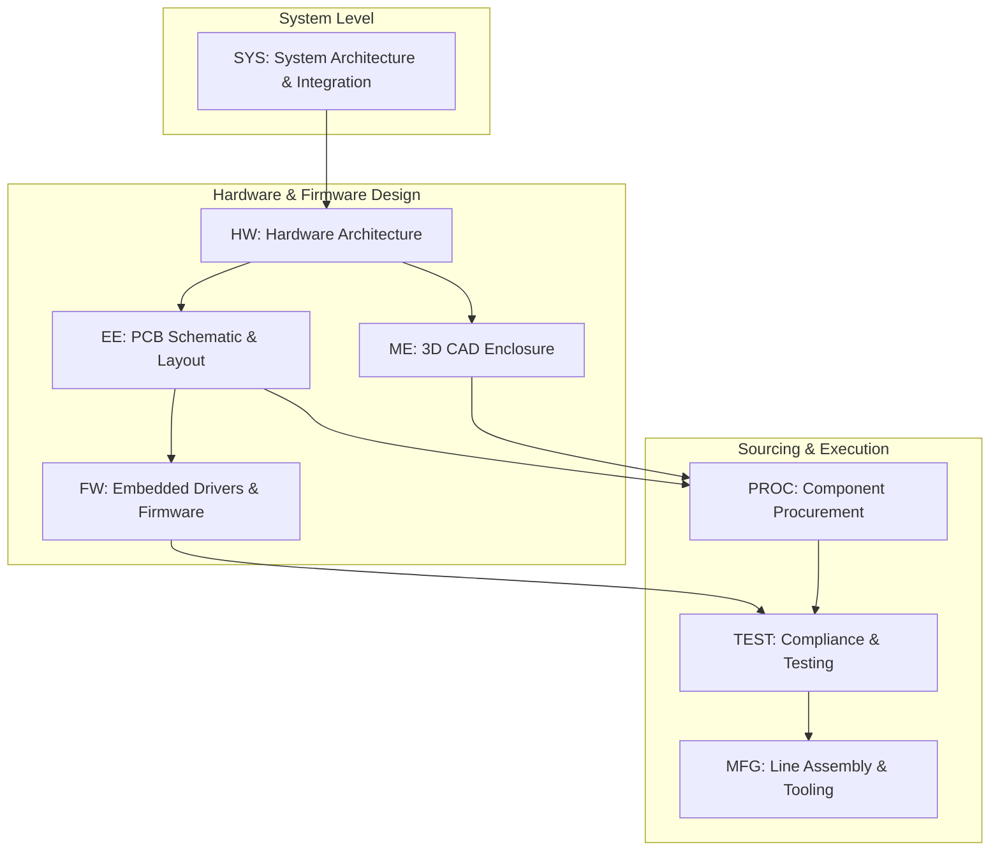

# Glossary of Abbreviations & Acronyms

This document provides a reference for all standard abbreviations, acronyms, stage gate terminology, dependency types, and workstream discipline codes used within the **Project Management Application**.

---

## 1. Project Development Stages

| Abbreviation | Full Name | Description |
| :--- | :--- | :--- |
| **Concept** | Product Conception & Feasibility | Initial product architecture, rough BOM costing, feasibility studies, and preliminary specifications. |
| **EVT** | Engineering Verification Test | First functional prototype build, board bring-up, schematic validation, and baseline functional testing. |
| **DVT** | Design Verification Test | Integration of final enclosure tooling, environmental stress testing, RF performance tuning, and regulatory pre-compliance. |
| **PVT** | Production Verification Test | Final pilot manufacturing run using production tooling and factory line assembly to verify yield and cycle times. |
| **MP** | Mass Production | Volume manufacturing rollout, full factory line operation, and commercial product launch. |

---

## 2. Workstream Discipline Codes

| Abbreviation | Discipline | Primary Responsibilities |
| :--- | :--- | :--- |
| **HW** | Hardware Engineering | Overall hardware architecture, system power budgeting, and multi-disciplinary hardware coordination. |
| **EE** | Electrical Engineering | Circuit design, schematic capture, component selection, PCB layout, and power distribution network (PDN). |
| **ME** | Mechanical Engineering | 3D CAD modeling, thermal management, industrial design enclosure, plastic injection tooling, and sheet metal design. |
| **FW** | Firmware Engineering | Low-level board support packages (BSP), microcontroller code, device drivers, communication protocols, and RTOS implementation. |
| **SYS** | System Engineering | End-to-end system integration, cross-functional interfaces, system-level safety analysis, and architecture requirements. |
| **PROC** | Procurement & Vendor Sourcing | Strategic component sourcing, long-lead IC procurement, fab vendor management, lead-time tracking, and supplier coordination. |
| **TEST** | Compliance & QA Testing | Functional testing, EMI/EMC compliance validation, environmental chamber qualification, and stress testing. |
| **MFG** | Manufacturing Operations | Production line setup, assembly work instructions, SMT programming, test fixture automation, and yield optimization. |

---

## 3. Dependency Link Types & Syntax

| Dependency | Name | Description | Example Syntax |
| :--- | :--- | :--- | :--- |
| **FS** | Finish-to-Start | Predecessor must finish before Successor can start (default). | `1` or `1FS` |
| **SS** | Start-to-Start | Predecessor must start before Successor can start. | `2SS` |
| **FF** | Finish-to-Finish | Predecessor must finish before Successor can finish. | `3FF` |
| **SF** | Start-to-Finish | Predecessor must start before Successor can finish. | `4SF` |
| **Lag** | Delay Offset | Adds working day delay between tasks. | `1FS+3d` |
| **Lead** | Acceleration Offset | Advances task start ahead of predecessor completion. | `2FS-2d` |

---

## 4. Scheduling & Analysis Metrics

| Abbreviation | Term | Definition |
| :--- | :--- | :--- |
| **WBS** | Work Breakdown Structure | Hierarchical breakdown of tasks into summary groups and child subtasks (e.g. `1`, `1.1`, `1.1.2`). |
| **CPM** | Critical Path Method | Analytical technique calculating the longest chain of dependent activities determining project completion. |
| **PERT** | Program Evaluation and Review Technique | Network diagram visualization displaying dependencies as a Directed Acyclic Graph (DAG). |
| **Slack / Float** | Total Float | The number of working days a task can be delayed without delaying the overall project target completion date. |
| **Baseline** | Baseline Snapshot | Stored benchmark copy of project dates used to calculate variance and schedule slippage. |
| **Variance** | Schedule Drift | The difference in working days between current finish date and baseline finish date ($\Delta\text{Days} = \text{Finish} - \text{BaselineFinish}$). |

