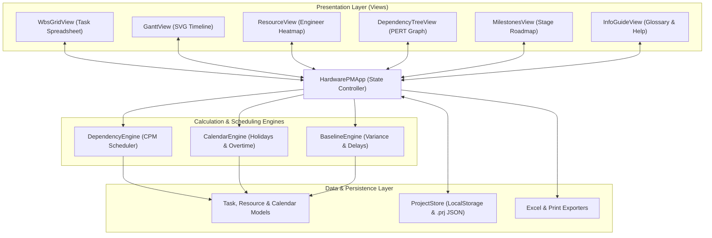

# Technical Architecture Documentation

This document provides a comprehensive technical overview of the **Project Management Application** architecture, data flow, calculation engines, SVG rendering pipeline, and production bundling system.

---

## 🏗️ High-Level System Architecture

The application is structured as a decoupled, event-driven frontend web app. It operates completely client-side in the browser, requiring no backend database or server infrastructure.

---

## 📦 1. Data Model Layer

### Task Model (`js/models/taskModel.js`)
The `Task` class represents individual activities, summary tasks, and milestones.
- **Key Attributes**:
  - `id`: Unique task identifier (`task_xxx`).
  - `wbs`: Hierarchical WBS string (e.g., `1`, `1.1`, `1.1.2`).
  - `name`: Task description.
  - `duration`: Working days count ($d \ge 0$). Tasks with `duration === 0` or `isMilestone = true` render as milestone diamonds.
  - `start`, `finish`: ISO date strings (`YYYY-MM-DD`).
  - `predecessors`: Dependency string (e.g. `1FS+2d, 3SS`).
  - `progress`: Completion percentage ($0 \dots 100$).
  - `stage`: Stage gate category (`Concept`, `EVT`, `DVT`, `PVT`, `MP`, or custom).
  - `workstream`: Functional discipline (`HW`, `EE`, `ME`, `FW`, `SYS`, `PROC`, `TEST`, `MFG`, or custom).
  - `status`: Execution status (`Not Started`, `In Design`, `In Fab`, `Testing`, `Blocked`, `Delayed`, `Complete`, or custom).
  - `assignedResources`: Array of fractional assignments: `[{ name: "Alex Rivera", units: 100 }, { name: "Sarah Chen", units: 50 }]`.
  - `leadTime`: Procurement/vendor lead-time in days.
  - `baseline`: Snapshot object `{ start, finish, duration }` or `null`.
  - `slack`, `isCritical`: Calculated CPM transient properties.

### Resource Model (`js/models/resourceModel.js`)
Represents team engineers and resource pool profiles.
- `id`: Resource identifier.
- `name`: Engineer name.
- `role`: Role title (e.g. *Lead PCB Engineer*).
- `workstream`: Primary discipline.
- `capacity`: Standard daily capacity percentage (default: `100%`).

### Calendar Model (`js/models/calendarModel.js`)
Defines the project work schedule.
- `workingDays`: Array of standard weekly working days (e.g. `[1, 2, 3, 4, 5]` for Mon–Fri).
- `holidays`: Array of festive/company holiday objects: `[{ date: '2026-10-02', name: 'Gandhi Jayanti' }]`.
- `overtimeDays`: Array of exception working dates: `[{ date: '2026-10-10', note: 'EVT Crunch Saturday' }]`.

---

## ⚙️ 2. Calculation Engines

### Calendar Engine (`js/engine/calendarEngine.js`)
Replaces naive weekend skipping with dynamic calendar evaluation:
1. **`isWorkingDay(dateStr, calendar)`**:
   - Returns `true` if `dateStr` is explicitly in `overtimeDays`.
   - Returns `false` if `dateStr` is in `holidays`.
   - Returns `true` if day of week is in `workingDays`.
2. **`addWorkingDays(startDateStr, days, calendar)`**: Advances date step-by-step counting only valid working days according to `isWorkingDay`.
3. **`getWorkingDays(startDateStr, endDateStr, calendar)`**: Counts exact working days between two dates inclusive.

### Dependency Engine & CPM Scheduler (`js/engine/dependencyEngine.js`)
1. **WBS Hierarchy Calculation**:
   - Recursively traverses task tree, assigning WBS strings (`1.1.1`).
   - Summary tasks auto-calculate Start date ($\min(\text{start})$), Finish date ($\max(\text{finish})$), Duration ($\text{WorkingDays}(\min, \max)$), and weighted Progress %.
2. **Predecessor String Parser**:
   - Parses regex `^([\w.]+)(FS|SS|FF|SF)?(?:([+-])(\d+)[dD]?)?$` supporting 4 dependency types and lead/lag offsets.
3. **Auto-Scheduling (Forward Pass)**:
   - Topological sorting and iterative forward pass updating task `start` and `finish` dates based on predecessor constraints:
     - **FS (Finish-to-Start)**: $\text{Start} = \text{Pred.Finish} + 1 + \text{Lag}$
     - **SS (Start-to-Start)**: $\text{Start} = \text{Pred.Start} + \text{Lag}$
     - **FF (Finish-to-Finish)**: $\text{Finish} = \text{Pred.Finish} + \text{Lag} \implies \text{Start} = \text{Finish} - \text{Duration}$
     - **SF (Start-to-Finish)**: $\text{Finish} = \text{Pred.Start} + \text{Lag} \implies \text{Start} = \text{Finish} - \text{Duration}$
4. **Critical Path Method (CPM Backward Pass)**:
   - Computes float/slack. Tasks on the project path with zero float or driving the project finish date are flagged as `isCritical = true`.

### Baseline Engine (`js/engine/baselineEngine.js`)
- **`captureBaseline(tasks)`**: Takes a deep snapshot of current `start`, `finish`, `duration` for all tasks.
- **`getVariance(task)`**: Calculates `startVarianceDays` and `finishVarianceDays`. Generates self-explaining status badges (`+4d Delay`, `On Track`, `-2d Ahead`).

---

## 🎨 3. View & Rendering Layer

### WBS Grid View (`js/views/wbsGridView.js`)
- Renders hierarchical spreadsheet table with expandable/collapsible summary rows.
- Inline input listeners update model state on field edits.
- Multi-engineer popover assignment modal allows checking engineers and assigning fractional units (`25%`, `50%`, `75%`, `100%`).
- `+ Add Custom...` inline option prompts user to write in custom Streams, Stages, or Status pills.

### Gantt View (`js/views/ganttView.js`)
- Custom SVG canvas timeline synchronized with WBS grid vertical scrolling.
- **Date-to-Pixel Projection**: $x = (\text{Date} - \text{StartDate}) \times \text{dayWidth}$.
- **SVG Dependency Connectors**: Renders orthogonal `<path>` lines with arrowhead markers (`#arrowhead-slate`, `#arrowhead-red`).
- **Baseline Shadow Ghost Bars**: Translucent shadow bars rendered below active task bars.
- **Bidirectional Drag & Drop**: Mouse listeners translate bar horizontal position into start date shifts or right handle drags into duration adjustments.

### Resource View (`js/views/resourceView.js`)
- Team Engineer Pool table + 21-day Fractional Workload Heatmap matrix.
- Iterates over `task.getAssignedResources()` and sums allocation `units` per engineer per date.
- Highlights overallocated cells ($>100\%$) in **Bold Red**.

### Dependency Tree / PERT View (`js/views/dependencyTreeView.js`)
- Renders an interactive Network Diagram (PERT flowchart) of tasks grouped by stage columns.
- Draws predecessor link badges and outlines Critical Path tasks in bold red outline.

### Info & Guide View (`js/views/infoGuideView.js`)
- Interactive help dashboard with a complete Glossary of Abbreviations and a 6-step User Manual.

---

## 💾 4. Storage, Export & Bundling

### Project Store (`js/storage/projectStore.js`)
- Auto-saves state to `localStorage` under `hardware_pm_project_data`.
- Export/Import `.prj` native JSON files containing version metadata, project title, tasks, resources, and calendar configuration.

### Excel Exporter (`js/export/excelExporter.js`)
- Integrates SheetJS (`xlsx.full.min.js`) to export multi-tab Excel (`.xlsx`) workbooks:
  1. `WBS Tasks`
  2. `Milestones`
  3. `Team Resources`
  4. `Project Calendar`

### Production Bundler (`build.py`)
- Reads `index.html` and `css/styles.css`.
- Topologically bundles all 17 JavaScript ES modules, strips module import/export keywords, and inlines CSS and JS into a single standalone distribution file: `dist/HardwarePM.html`.

