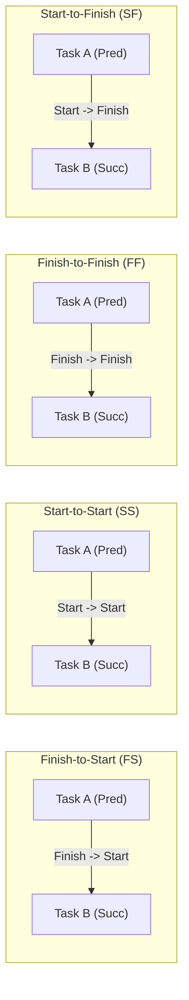
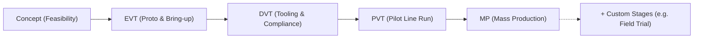
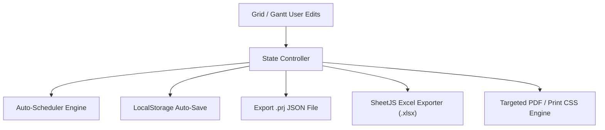

# Project Management Application - User Guide

Welcome to the **Project Management Application** user manual. This guide explains how to effectively plan, schedule, track, assign resources, configure calendars, and analyze project deliverables.

---

## 📖 Table of Contents
1. [Getting Started & Deployment Modes](#1-getting-started--deployment-modes)
2. [Interface Overview & Navigation](#2-interface-overview--navigation)
3. [WBS Task Hierarchy & Table Editing](#3-wbs-task-hierarchy--table-editing)
4. [Predecessor Dependencies & Lag Syntax](#4-predecessor-dependencies--lag-syntax)
5. [Interactive Gantt Chart & Drag-and-Drop](#5-interactive-gantt-chart--drag-and-drop)
6. [Multi-Engineer Assignments & Fractional Loading](#6-multi-engineer-assignments--fractional-loading)
7. [Custom Project Calendar, Holidays & Overtime](#7-custom-project-calendar-holidays--overtime)
8. [Baseline Tracking & Delay Variance Badges](#8-baseline-tracking--delay-variance-badges)
9. [Network Diagram & Dependency Tree (PERT)](#9-network-diagram--dependency-tree-pert)
10. [Custom Stages, Streams & Status Pills](#10-custom-stages-streams--status-pills)
11. [Saving, File Persistence & Excel Exports](#11-saving-file-persistence--excel-exports)
12. [Targeted PDF & Print Exports](#12-targeted-pdf--print-exports)

---

## 1. Getting Started & Deployment Modes

### Standalone Production Mode (Recommended)
Open `dist/HardwarePM.html` directly in any web browser (Chrome, Firefox, Edge, Safari). No installation, Node.js server, or internet connection is required.

### Development Mode
If running from source code, serve the root directory using any HTTP server:
```bash
python3 -m http.server 8000
# Open http://localhost:8000
```

---

## 2. Interface Overview & Navigation

The top header bar provides instant access to project management controls:

- **Project Title Input**: Click the text box at top-left to rename your project schedule.
- **View Switcher Bar**:
  - **Grid & Gantt**: Split view containing spreadsheet activity list and Gantt chart.
  - **Engineer Workload**: Team resource pool table and daily workload heatmap matrix.
  - **Dependency Tree**: Interactive PERT flowchart graph of all tasks.
  - **Milestones**: Executive stage gate deliverables roadmap.
  - **❓ Info & Guide**: Built-in glossary of abbreviations and quick-start reference manual.
- **Toolbar Actions**:
  - **Calendar**: Opens project calendar settings (offs, holidays, overtime).
  - **Baseline**: Snapshots current schedule as the target benchmark.
  - **Save (.prj)** / **Open (.prj)**: Downloads or opens native project bundle files.
  - **Excel**: Exports multi-tab Excel (`.xlsx`) spreadsheets.
  - **New / Presets...**: Create a clean new project or load pre-built sample templates.
  - **Print / PDF...**: Export specific views to PDF/printer.

---

## 3. WBS Task Hierarchy & Table Editing

### Creating & Hierarchically Structuring Tasks
1. Click **Add Activity** in the Grid toolbar to insert a new row.
2. Select a row and click **Subtask** or **Indent** to indent the activity underneath the previous row, turning the parent into a **Summary Task**.
3. Click **Outdent** to promote a subtask up one hierarchy level.

### Milestone Diamonds
Any activity with **`0` duration** or marked as a milestone automatically renders as a diamond on the Gantt timeline and Milestone Roadmap.

---

## 4. Predecessor Dependencies & Lag Syntax

In the **Predecessors** column, type predecessor links using WBS numbers, task indices, or task IDs:

| Syntax | Dependency Type | Description |
| :--- | :--- | :--- |
| `1` or `1FS` | Finish-to-Start | Task starts after Task 1 finishes. |
| `2FS+3d` | FS with 3-day Lag | Task starts 3 working days after Task 2 finishes. |
| `3SS` | Start-to-Start | Task starts at the same time Task 3 starts. |
| `4SS-2d` | SS with 2-day Lead | Task starts 2 working days before Task 4 starts. |
| `5FF` | Finish-to-Finish | Task finishes at the same time Task 5 finishes. |
| `6SF` | Start-to-Finish | Task finishes when Task 6 starts. |
| `1FS+2d, 3SS` | Multiple Predecessors | Separate multiple dependency constraints with commas. |



---

## 5. Interactive Gantt Chart & Drag-and-Drop

### Timeline Controls & Zoom
Toggle zoom levels between **Day** (44px/day), **Week** (28px/day), and **Month** (14px/day) in the Gantt toolbar.

### Drag-and-Drop Operations
- **Shift Dates**: Click and drag the body of any colored task bar left or right to translate Start and Finish dates.
- **Adjust Duration**: Click and drag the right edge handle of a task bar to extend or reduce duration in working days.

### Critical Path Toggle
Check **Critical Path** in the Gantt toolbar to outline bottleneck tasks and dependency connector arrows in **bold red**.

---

## 6. Multi-Engineer Assignments & Fractional Loading

### Assigning Multiple Engineers & Units (%)
1. In the WBS Grid, click any cell in the **Assigned Engineers** column.
2. In the popover assignment window:
   - Check the engineers assigned to work on the activity.
   - Select fractional day allocation units for each engineer (`25%` = 2h, `50%` = 4h, `75%` = 6h, `100%` = 8h).
3. Click **Save Assignments**.

### Inspecting Engineer Workload Heatmap
Switch to the **Engineer Workload** tab:
- Matrix shows daily capacity loading per engineer.
- **Normal Loading ($\le 100\%$)**: Displayed in emerald green (e.g. `100%` or `50%`).
- **Over-Allocation ($> 100\%$)**: Displayed in **bold red** (e.g. `150%`), alerting the PM that an engineer is double-booked across overlapping tasks.

---

## 7. Custom Project Calendar, Holidays & Overtime

Click **Calendar** in the top header:

1. **Weekly Working Days**: Check standard working days (e.g. Mon–Fri for 5-day week, or Mon–Sat for 6-day week).
2. **Festive & Company Holidays**: Enter Date and Holiday Name (e.g., `2026-10-02: Gandhi Jayanti`) and click **+ Add Holiday**. Tasks automatically skip holiday dates.
3. **Overtime Working Days**: Enter Date and Note (e.g., `2026-10-10: EVT Crunch Saturday`) and click **+ Add Overtime**. Engine treats overtime dates as active working days.

---

## 8. Baseline Tracking & Delay Variance Badges

1. When target schedule is finalized, click **Baseline** in the toolbar to save a baseline snapshot.
2. If task dates slip, translucent **Baseline Ghost Bars** appear underneath current task bars on the Gantt timeline.
3. Self-explaining **Variance Badges** display drift callouts (e.g. `+4d Delay`, `On Track`, `-2d Ahead`).

---

## 9. Network Diagram & Dependency Tree (PERT)

Switch to the **Dependency Tree** tab:
- Renders an interactive flowchart DAG of all tasks grouped by stage columns.
- Shows task cards with WBS ID, Name, Stream, Stage, Engineer, Duration, Lead Time, and Status.
- Connects tasks with predecessor link badges and traces the **Critical Path** in bold red.

---

## 10. Custom Stages, Streams & Status Pills

When editing a task's **Stream**, **Stage**, or **Status** in the WBS Grid, select **`+ Add Custom...`** at the bottom of the dropdown list:
- Type your custom write-in label (e.g. *Field Trial* for stage, *REL* for reliability stream, or *In Review* for status).
- Custom options are automatically saved into project settings and persisted in `.prj` files.



---

## 11. Saving, File Persistence & Excel Exports

- **Save (.prj)**: Downloads current project state as a `.prj` JSON file.
- **Open (.prj)**: Loads an existing `.prj` file.
- **Excel**: Exports a multi-tab workbook (`.xlsx`) containing *WBS Tasks*, *Milestones*, *Team Resources*, and *Project Calendar & Holidays*.



---

## 12. Targeted PDF & Print Exports

In the top header, select **Print / PDF...**:
- **Print Full Screen**: Prints active view.
- **Print Gantt Timeline ONLY**: Hides table grid and navigation for clean Gantt PDF output.
- **Print Activity List ONLY**: Prints activity sheet table.
- **Print Milestones Roadmap ONLY**: Prints executive milestone board.

